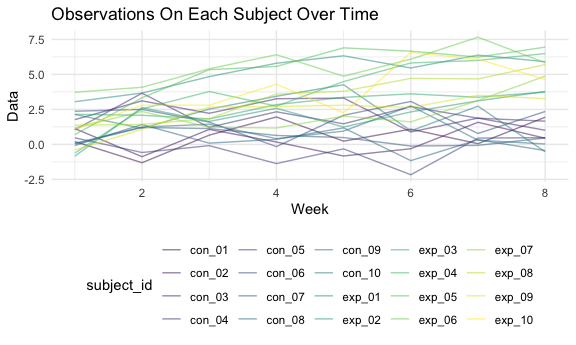

p8105\_hw5\_wq2161
================
Wanxin Qi
11/14/2021

## Problem 1

## Problem 2

Create a tidy dataframe containing data from all participants, including
the subject ID, arm, and observations over time. Make a spaghetti plot
showing observations on each subject over time, and comment on
differences between groups.

``` r
empty_df = 
  tibble(
    file_name = list.files("data", full.names = TRUE)
  )

read_df = function(path) {
  file_data = read_csv(path)
}

long_study = 
  empty_df %>%
  mutate(
    data_value = purrr::map(pull(empty_df, file_name), read_df),
    file_name = substr(file_name, 6, 11)
  ) %>%
  unnest(cols = data_value)

long_study =
  long_study %>%
  pivot_longer(
    week_1:week_8,
    names_to = "week",
    values_to = "data_value"
  ) %>%
  mutate(
    week = substr(week, 6, 6),
    week = as.integer(week),
    subject_arm = substr(file_name, 1, 3)
  ) %>%
  rename(subject_id = file_name) %>%
  relocate(subject_arm, subject_id) %>%
  mutate(
    subject_arm = factor(subject_arm, levels = c("con", "exp"), ordered = FALSE)
  )

long_study
```

    ## # A tibble: 160 × 4
    ##    subject_arm subject_id  week data_value
    ##    <fct>       <chr>      <int>      <dbl>
    ##  1 con         con_01         1       0.2 
    ##  2 con         con_01         2      -1.31
    ##  3 con         con_01         3       0.66
    ##  4 con         con_01         4       1.96
    ##  5 con         con_01         5       0.23
    ##  6 con         con_01         6       1.09
    ##  7 con         con_01         7       0.05
    ##  8 con         con_01         8       1.94
    ##  9 con         con_02         1       1.13
    ## 10 con         con_02         2      -0.88
    ## # … with 150 more rows

``` r
long_study %>%
  ggplot(aes(x = week, y = data_value, color = subject_id)) +
  geom_line(alpha = .5) +
  labs(
    title = "Observations On Each Subject Over Time",
    x = "Week",
    y = "Data"
  )
```



## Problem 3

Write a function that takes a vector as an argument; replaces missing
values using the rules defined; returns the resulting vector.

-   For numeric variables, you should fill in missing values with the
    mean of non-missing values

-   For character variables, you should fill in missing values with
    “virginica”

Apply this function to the columns of iris\_with\_missing using a map
statement.

``` r
set.seed(10)

iris_with_missing = iris %>% 
  map_df(~replace(.x, sample(1:150, 20), NA)) %>%
  mutate(Species = as.character(Species))

refill_missing_value = function(column) {
  
  if (is.numeric(column)) {
    column = replace_na(column, round(mean(column, na.rm = TRUE), digits = 1))
  }
  
  if (is.character(column)) {
    column = replace_na(column, "virginica")
  }
  
  return(column)
  
}

iris_refill_missing = map(iris_with_missing, refill_missing_value)

iris_with_missing =
  tibble(
    Sepal.Length = iris_refill_missing[["Sepal.Length"]],
    Sepal.Width = iris_refill_missing[["Sepal.Width"]],
    Petal.Length = iris_refill_missing[["Petal.Length"]],
    Petal.Width = iris_refill_missing[["Petal.Width"]],
    Species = iris_refill_missing[["Species"]]
  )

iris_with_missing
```

    ## # A tibble: 150 × 5
    ##    Sepal.Length Sepal.Width Petal.Length Petal.Width Species
    ##           <dbl>       <dbl>        <dbl>       <dbl> <chr>  
    ##  1          5.1         3.5          1.4         0.2 setosa 
    ##  2          4.9         3            1.4         0.2 setosa 
    ##  3          4.7         3.2          1.3         0.2 setosa 
    ##  4          4.6         3.1          1.5         1.2 setosa 
    ##  5          5           3.6          1.4         0.2 setosa 
    ##  6          5.4         3.9          1.7         0.4 setosa 
    ##  7          5.8         3.4          1.4         0.3 setosa 
    ##  8          5           3.4          1.5         0.2 setosa 
    ##  9          4.4         2.9          1.4         0.2 setosa 
    ## 10          4.9         3.1          3.8         0.1 setosa 
    ## # … with 140 more rows
