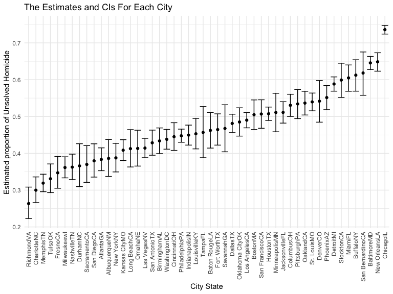

p8105\_hw5\_wq2161
================
Wanxin Qi
11/14/2021

## Problem 1

Describe the raw data.

``` r
homicide_df = read_csv("data/homicide-data.csv", na = c("", "Unknown"))

head(homicide_df)
```

    ## # A tibble: 6 × 12
    ##   uid        reported_date victim_last victim_first victim_race victim_age victim_sex
    ##   <chr>              <dbl> <chr>       <chr>        <chr>            <dbl> <chr>     
    ## 1 Alb-000001      20100504 GARCIA      JUAN         Hispanic            78 Male      
    ## 2 Alb-000002      20100216 MONTOYA     CAMERON      Hispanic            17 Male      
    ## 3 Alb-000003      20100601 SATTERFIELD VIVIANA      White               15 Female    
    ## 4 Alb-000004      20100101 MENDIOLA    CARLOS       Hispanic            32 Male      
    ## 5 Alb-000005      20100102 MULA        VIVIAN       White               72 Female    
    ## 6 Alb-000006      20100126 BOOK        GERALDINE    White               91 Female    
    ## # … with 5 more variables: city <chr>, state <chr>, lat <dbl>, lon <dbl>,
    ## #   disposition <chr>

The dataset includes the data on homicides in 50 large U.S. cities
gathered by the Washington Post. It contains 12 variables, which are
uid, reported\_date, victim\_last, victim\_first, victim\_race,
victim\_age, victim\_sex, city, state, lat, lon, disposition, and 52179
observations.

Create a city\_state variable and then summarize within cities to obtain
the total number of homicides and the number of unsolved homicides.

``` r
homicide_df =
  homicide_df %>%
  mutate(city_state = str_c(city, state),
         resolution = case_when(
           disposition == "Closed without arrest" ~ "unsolved",
           disposition == "Open/No arrest"        ~ "unsolved",
           disposition == "Closed by arrest"      ~ "solved",
         )) %>%
  relocate(city_state) %>%
  filter(city_state != "TulsaAL")

homicide_summary = 
  homicide_df %>%
    select(-city, -state) %>%
    group_by(city_state) %>%
    summarize(
      n_unsolved = sum(resolution == "unsolved"),
      n_homicide = n()
    )

homicide_summary
```

    ## # A tibble: 50 × 3
    ##    city_state    n_unsolved n_homicide
    ##    <chr>              <int>      <int>
    ##  1 AlbuquerqueNM        146        378
    ##  2 AtlantaGA            373        973
    ##  3 BaltimoreMD         1825       2827
    ##  4 Baton RougeLA        196        424
    ##  5 BirminghamAL         347        800
    ##  6 BostonMA             310        614
    ##  7 BuffaloNY            319        521
    ##  8 CharlotteNC          206        687
    ##  9 ChicagoIL           4073       5535
    ## 10 CincinnatiOH         309        694
    ## # … with 40 more rows

For the city of Baltimore, MD, use the prop.test function to estimate
the proportion of homicides that are unsolved; save the output of
prop.test as an R object, apply the broom::tidy to this object and pull
the estimated proportion and confidence intervals from the resulting
tidy dataframe.

``` r
baltimore_df =
  homicide_df %>%
  filter(city_state == "BaltimoreMD")

baltimore_summary = 
  baltimore_df %>%
    summarize(
      unsolved = sum(resolution == "unsolved"),
      n = n()
    )

baltimore_test = 
  prop.test(
    x = baltimore_summary %>% pull(unsolved),
    n = baltimore_summary %>% pull(n))

baltimore_test %>%
  broom::tidy() %>%
  select(estimate, starts_with("conf"))
```

    ## # A tibble: 1 × 3
    ##   estimate conf.low conf.high
    ##      <dbl>    <dbl>     <dbl>
    ## 1    0.646    0.628     0.663

Run prop.test for each of the cities in the dataset, and extract both
the proportion of unsolved homicides and the confidence interval for
each. Do this within a “tidy” pipeline, making use of `purrr::map`,
`purrr::map2`, list columns and unnest as necessary to create a tidy
dataframe with estimated proportions and CIs for each city.

``` r
prop_test_function = function(city_df) {
  
  city_summary = 
    city_df %>%
      summarize(
        unsolved = sum(resolution == "unsolved"),
        n = n()
      )

  city_test = 
    prop.test(
      x = city_summary %>% pull(unsolved),
      n = city_summary %>% pull(n))
  
  return(city_test)
  
}

results_df =
  homicide_df %>%
  nest(data = uid:resolution) %>%
  mutate(
    test_results = map(data, prop_test_function),
    tidy_results = map(test_results, broom::tidy)
  ) %>%
  select(city_state, tidy_results) %>%
  unnest(tidy_results) %>%
  select(city_state, estimate, starts_with("conf"))

results_df
```

    ## # A tibble: 50 × 4
    ##    city_state    estimate conf.low conf.high
    ##    <chr>            <dbl>    <dbl>     <dbl>
    ##  1 AlbuquerqueNM    0.386    0.337     0.438
    ##  2 AtlantaGA        0.383    0.353     0.415
    ##  3 BaltimoreMD      0.646    0.628     0.663
    ##  4 Baton RougeLA    0.462    0.414     0.511
    ##  5 BirminghamAL     0.434    0.399     0.469
    ##  6 BostonMA         0.505    0.465     0.545
    ##  7 BuffaloNY        0.612    0.569     0.654
    ##  8 CharlotteNC      0.300    0.266     0.336
    ##  9 ChicagoIL        0.736    0.724     0.747
    ## 10 CincinnatiOH     0.445    0.408     0.483
    ## # … with 40 more rows

Create a plot that shows the estimates and CIs for each city – check out
geom\_errorbar for a way to add error bars based on the upper and lower
limits. Organize cities according to the proportion of unsolved
homicides.

``` r
results_df %>%
  mutate(city_state = fct_reorder(city_state, estimate)) %>%
  ggplot(aes(x = city_state, y = estimate)) +
  geom_point() +
  geom_errorbar(aes(ymin = conf.low, ymax = conf.high)) +
  theme(axis.text.x = element_text(angle = 90, vjust = 0.5, hjust = 1)) +
  labs(
    title = "The Estimates and CIs For Each City",
    x = "City State",
    y = "Estimated proportion of Unsolved Homicide"
  )
```



## Problem 2

Create a tidy dataframe containing data from all participants, including
the subject ID, arm, and observations over time. Make a spaghetti plot
showing observations on each subject over time, and comment on
differences between groups.

``` r
empty_df = 
  tibble(
    file_name = list.files("data/p2", full.names = TRUE)
  )

read_df = function(path) {
  file_data = read_csv(path)
}

long_study = 
  empty_df %>%
  mutate(
    data_value = purrr::map(pull(empty_df, file_name), read_df),
    file_name = substr(file_name, 9, 14)
  ) %>%
  unnest(cols = data_value)

long_study =
  long_study %>%
  pivot_longer(
    week_1:week_8,
    names_to = "week",
    values_to = "data_value"
  ) %>%
  mutate(
    week = substr(week, 6, 6),
    week = as.integer(week),
    subject_arm = substr(file_name, 1, 3)
  ) %>%
  rename(subject_id = file_name) %>%
  relocate(subject_arm, subject_id) %>%
  mutate(
    subject_arm = factor(subject_arm, levels = c("con", "exp"), ordered = FALSE)
  )

long_study
```

    ## # A tibble: 160 × 4
    ##    subject_arm subject_id  week data_value
    ##    <fct>       <chr>      <int>      <dbl>
    ##  1 con         con_01         1       0.2 
    ##  2 con         con_01         2      -1.31
    ##  3 con         con_01         3       0.66
    ##  4 con         con_01         4       1.96
    ##  5 con         con_01         5       0.23
    ##  6 con         con_01         6       1.09
    ##  7 con         con_01         7       0.05
    ##  8 con         con_01         8       1.94
    ##  9 con         con_02         1       1.13
    ## 10 con         con_02         2      -0.88
    ## # … with 150 more rows

``` r
long_study %>%
  ggplot(aes(x = week, y = data_value, color = subject_id)) +
  geom_line(alpha = .5) +
  geom_point(aes(shape = subject_arm), size = 1.5, alpha = .5) +
  labs(
    title = "Observations On Each Subject Over Time",
    x = "Week",
    y = "Data"
  ) + 
  theme(
    legend.box = "vertical",
    legend.key.size = unit(0.5, "pt"),
    legend.title = element_text(size = 10),
    legend.text = element_text(size = 8)
  )
```


Based on the spaghetti plot, the data value of experimental group is
generally greater than control group.

## Problem 3

Write a function that takes a vector as an argument; replaces missing
values using the rules defined; returns the resulting vector.

-   For numeric variables, you should fill in missing values with the
    mean of non-missing values

-   For character variables, you should fill in missing values with
    “virginica”

Apply this function to the columns of iris\_with\_missing using a map
statement.

``` r
set.seed(10)

iris_with_missing = iris %>% 
  map_df(~replace(.x, sample(1:150, 20), NA)) %>%
  mutate(Species = as.character(Species))

refill_missing_value = function(column) {
  
  if (is.numeric(column)) {
    column = replace_na(column, round(mean(column, na.rm = TRUE), digits = 1))
  }
  
  if (is.character(column)) {
    column = replace_na(column, "virginica")
  }
  
  return(column)
  
}

iris_refill_missing = map(iris_with_missing, refill_missing_value)

iris_without_missing =
  tibble(
    Sepal.Length = iris_refill_missing[["Sepal.Length"]],
    Sepal.Width = iris_refill_missing[["Sepal.Width"]],
    Petal.Length = iris_refill_missing[["Petal.Length"]],
    Petal.Width = iris_refill_missing[["Petal.Width"]],
    Species = iris_refill_missing[["Species"]]
  )

iris_without_missing
```

    ## # A tibble: 150 × 5
    ##    Sepal.Length Sepal.Width Petal.Length Petal.Width Species
    ##           <dbl>       <dbl>        <dbl>       <dbl> <chr>  
    ##  1          5.1         3.5          1.4         0.2 setosa 
    ##  2          4.9         3            1.4         0.2 setosa 
    ##  3          4.7         3.2          1.3         0.2 setosa 
    ##  4          4.6         3.1          1.5         1.2 setosa 
    ##  5          5           3.6          1.4         0.2 setosa 
    ##  6          5.4         3.9          1.7         0.4 setosa 
    ##  7          5.8         3.4          1.4         0.3 setosa 
    ##  8          5           3.4          1.5         0.2 setosa 
    ##  9          4.4         2.9          1.4         0.2 setosa 
    ## 10          4.9         3.1          3.8         0.1 setosa 
    ## # … with 140 more rows
