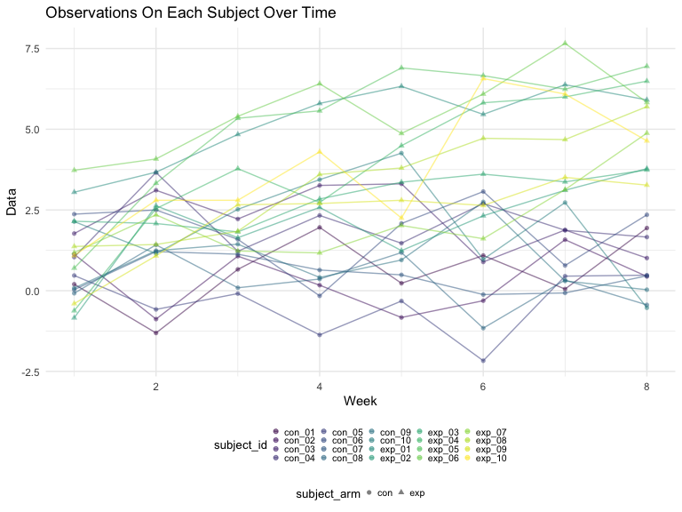

p8105\_hw5\_wq2161
================
Wanxin Qi
11/14/2021

## Problem 1

## Problem 2

Create a tidy dataframe containing data from all participants, including
the subject ID, arm, and observations over time. Make a spaghetti plot
showing observations on each subject over time, and comment on
differences between groups.

``` r
empty_df = 
  tibble(
    file_name = list.files("data", full.names = TRUE)
  )

read_df = function(path) {
  file_data = read_csv(path)
}

long_study = 
  empty_df %>%
  mutate(
    data_value = purrr::map(pull(empty_df, file_name), read_df),
    file_name = substr(file_name, 6, 11)
  ) %>%
  unnest(cols = data_value)

long_study =
  long_study %>%
  pivot_longer(
    week_1:week_8,
    names_to = "week",
    values_to = "data_value"
  ) %>%
  mutate(
    week = substr(week, 6, 6),
    week = as.integer(week)
  )

long_study
```

    ## # A tibble: 160 × 3
    ##    file_name  week data_value
    ##    <chr>     <int>      <dbl>
    ##  1 con_01        1       0.2 
    ##  2 con_01        2      -1.31
    ##  3 con_01        3       0.66
    ##  4 con_01        4       1.96
    ##  5 con_01        5       0.23
    ##  6 con_01        6       1.09
    ##  7 con_01        7       0.05
    ##  8 con_01        8       1.94
    ##  9 con_02        1       1.13
    ## 10 con_02        2      -0.88
    ## # … with 150 more rows

``` r
long_study %>%
  ggplot(aes(x = week, y = data_value)) +
  geom_line(aes(color = file_name), alpha = .5) +
  labs(
    title = "Observations On Each Subject Over Time",
    x = "Week",
    y = "Data"
  )
```



## Problem 3
